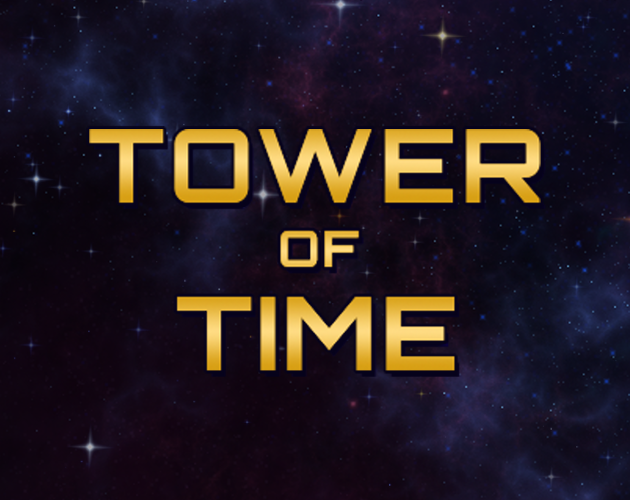
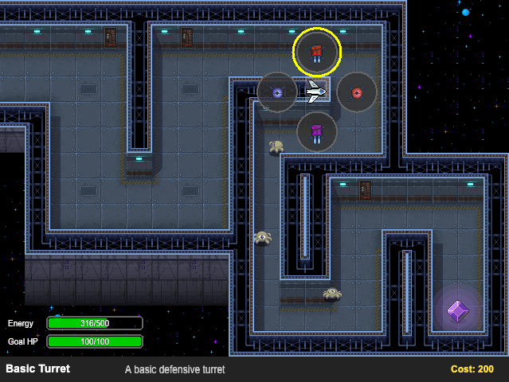

<div align="center">
  
</div>

# Tower of Time

*Entry for Beginner's Jam Summer 2025*

A time-traveling tower defense game where you defend your base against waves of enemies using the power to rewind time.

**[🎮 Play the game at https://m4v3k.itch.io/tower-of-time](https://m4v3k.itch.io/tower-of-time)**



## About

Tower of Time is a unique tower defense game that combines strategic building with time manipulation mechanics. When enemies overwhelm your defenses, use your time-travel powers to rewind and rebuild your strategy. The game features multiple tower types, energy management, and wave-based enemy spawning.

### Key Features

- **Time Rewind**: Roll back time to survive the enemy waves
- **Multiple Tower Types**: Basic turrets, sniper towers, slowdown towers, and splash damage towers
- **Energy System**: Manage energy for building towers and rewinding time

## Controls

Game supports both keyboard and gamepad.

- **Move**: Arrow Keys / Gamepad Analog Stick
- **Action**: Spacebar / Cross (PlayStation) / A (Xbox)
- **Rewind**: Backspace / Left Trigger

## Tech Stack

- **Engine**: Phaser 3 (v3.90.0) with Phaser Editor v4
- **Language**: TypeScript
- **Build Tool**: Vite

## Development

### Requirements

- [Node.js](https://nodejs.org) (for package management)
- [pnpm](https://pnpm.io) (package manager)

### Available Commands

| Command | Description |
|---------|-------------|
| `pnpm install` | Install project dependencies |
| `pnpm dev` | Start development server |
| `pnpm build` | Build for production |

### Project Structure

```
src/
├── main.ts         # Entry point and configuration
├── scenes/         # Scenes (Title, Level, Configure)
├── prefabs/        # Prefabs (Player, Towers, Enemies)
├── systems/        # Systems (Energy, Building, Config)
├── components/     # Components (Input, Rewind)
├── ui/             # UI components (Bars, Menus, Dialogs)
└── utils/          # Utilities (Sound, Music, Keys)
public/
├── assets/         # Assets (Images, Sounds, Fonts)
├── style.css       # Basic CSS styles
index.html          # Game entry point
```

## Vibe Coding Proof of Concept

This game serves as a proof of concept for AI-assisted game development. Approximately 95% of the codebase was written by AI using:

- **[Augment Code](https://augmentcode.com)** - Advanced codebase context and AI coding assistance
- **[Cursor](https://cursor.sh)** - AI-powered code editor, mostly using Agent mode
- **Claude Sonnet 4** - My LLM of choice for this project (also used OpenAI o3 and Claude Opus 4 occasionally)

The development process demonstrates how modern AI tools can accelerate game development while maintaining code quality and architectural consistency. For detailed prompts and development process, see [PROMPTS.md](PROMPTS.md).

What I've learned:

- It is entirely possible to develop a game with AI, but you need to know what you're doing
- AI makes prototyping super fast, but as you transition from prototype to final game you need to be careful
- AIs like to write *a lot* of code, this project could probably have two times less code
- Claude Sonnet 4 knows Phaser.js pretty well but for key areas I've given it a URL to the docs for the specific feature I was working on and it helped
- If the AI gets stuck on something ask it to add debug/console logs and share them with the agent
- If after that it still gets stuck don't fight it, roll back everything and try rephrasing the prompt or giving it more context

## Credits

- **Idea, coding & art**: m4v3k
- **Balancing, menu music & testing**: death_unites_us
- **In-game music**: Amnesia Fortnight - "A - Spacebase DF-9"

### Art Assets

- **Space Station-Game** asset by **jonik9i**
- **Ocunid** Monster by **Robocelot**
- **Void Main Ship** by **Foozle**
- **Pixel purple gem** by **Lunarnia**
- **Seamless Space Backgrounds** by **Screaming Brain Studios**
- Sounds from freesound.org

## License

MIT License - see [LICENSE](LICENSE) file for details.
